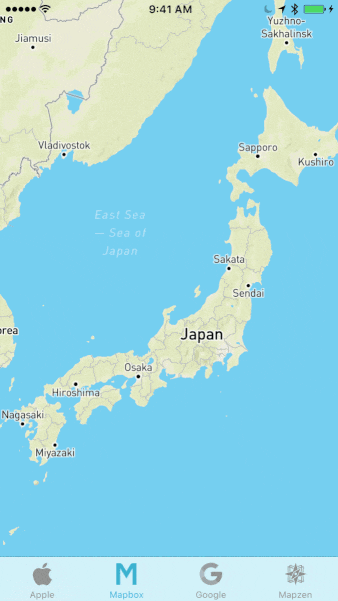

# Treble

[Mapbox Maps SDK for iOS](https://github.com/mapbox/mapbox-gl-native) comparison app, featuring [Apple MapKit](https://developer.apple.com/library/ios/documentation/MapKit/Reference/MapKit_Framework_Reference/) and [Google Maps for iOS](https://developers.google.com/maps/documentation/ios-sdk/).

## Getting started

1. `bundle install && bundle exec pod install`
2. `cp treble/APIKeys.EXAMPLE.plist treble/APIKeys.plist`
3. `xed .` to open the workspace in Xcode.
4. Add your [Mapbox access token](https://www.mapbox.com/help/create-api-access-token/) and [Google API key](https://developers.google.com/maps/documentation/ios-sdk/get-api-key) to `APIKeys.plist`.

## Usage

- Keep tapping the selected tab to switch styles.
- Swipe on the bottom tab bar to switch providers.
- Tap the top status bar to recenter the map on your location.

## URL scheme

To load a Mapbox map in Treble at a particular location, you can use this URL scheme in by entering it in Mobile Safari, sending it to your mobile device via AirDrop/Slack/etc., or implementing it in your iOS app:

`treble://?lat=40.73&lng=-73.94&zoom=10`

### Supported query parameters

 * `lat`: set the map latitude
 * `lng`: set the map longitude
 * `zoom`: set the map zoom level (`0` being the whole world)
 * `bearing`: set the map bearing in degrees clockwise from due north
 * `pitch`: set the map pitch (`0` looking directly overhead, `60` being maximum tilt)
